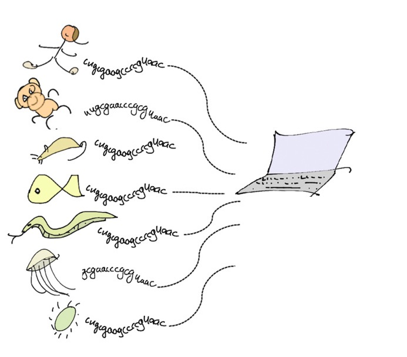

## Contents

- [Abstract](index.html)
- [Project Motivation](motivation.html)
- [Biological & Theoretical Background](background.html)
- [Model Structure](structure.html)
- [Usage](usage.html)
- [First Steps: Pyro](pyro.html)
- [Model Reconstruction](model.html)
- [Performance Comparison](performance.html)
- [Conclusions](conclusions.html)

# Abstract

Being able to accurately predict how different mutations will affect a biomolecule's function remains a major challenge in the fields of biology, medicine and bioengineering - with the exponentially large feature space of biological sequences limiting the viability of experimentally driven approaches. To tackle this problem, the marks lab developed a [deep generative model](https://github.com/debbiemarkslab/DeepSequence) capable of predicting mutational effects substantially better than previously available statistical models. This model was constructed using Theano, a machine learning library that, as of 2017, is no longer being actively maintained or updated. Here, this deep generative model is reconstructed in PyTorch, a more modern library that is still being actively developed, in the hope of creating a model that is more functional, readable, and developable.

